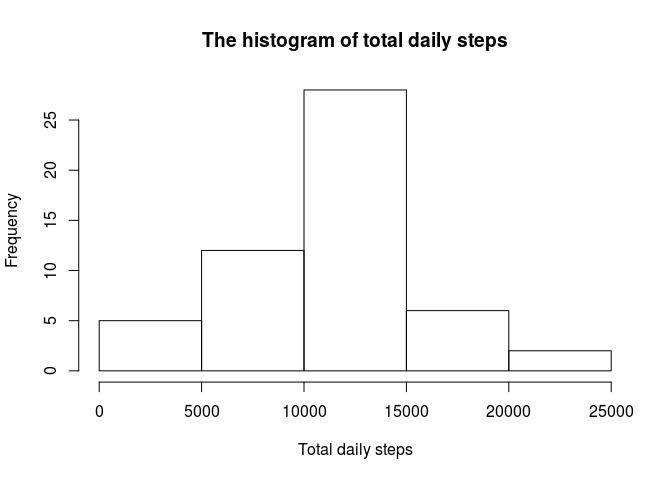
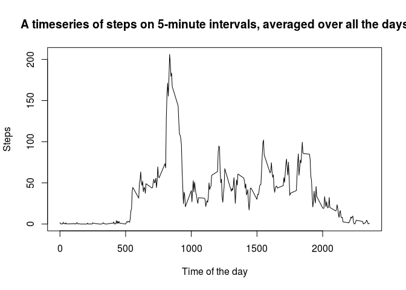
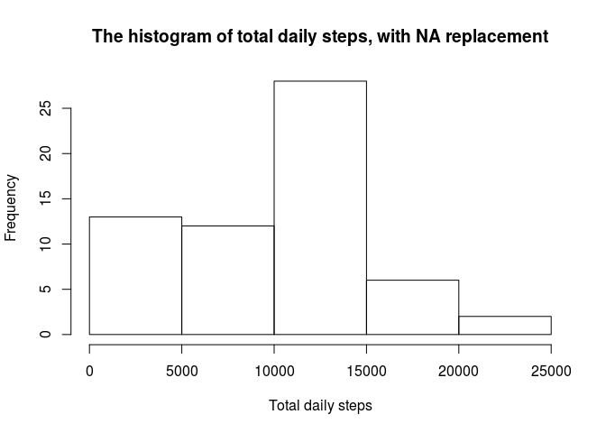
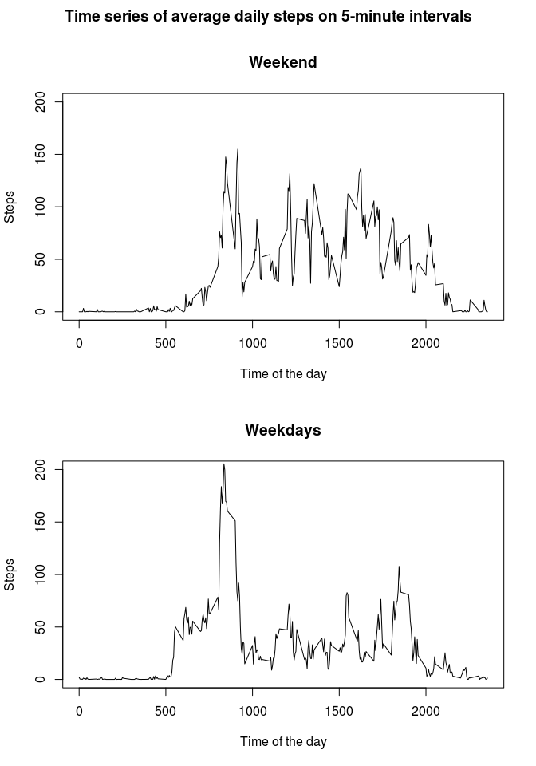

# Reproducible Research: Peer Assessment 1
In this document we study personal step counts recorded during October and November 2012. The steps are recorded for each day and each 5-minute interval of the day.

## Loading and preprocessing the data
Let us read the data and draw a histogram of the total daily steps.


```r
options(scipen = 999, digits=2)
data <-read.csv("activity.csv",header=T)
dailytotal<-tapply(data$steps, data$date, sum)
hist(dailytotal, main="The histogram of total daily steps", xlab="Total daily steps")
```

<!-- -->

```r
dailymean<-mean(dailytotal, na.rm=T)
dailymedian<-median(dailytotal, na.rm=T)
print(dailymean)
```

```
## [1] 10766
```

```r
print(dailymedian)
```

```
## [1] 10765
```


## What is mean total number of steps taken per day?

On average, there were 10766.19 steps taken per day, while the median was 10765.


## What is the average daily activity pattern?
Let us now study the intervals.

```r
intervalaverage <-tapply(data$steps, data$interval, mean, na.rm=TRUE)
plot(names(intervalaverage),intervalaverage, type="l", main="A timeseries of steps on 5-minute intervals, averaged over all the days", ylab="Steps", xlab="Time of the day")
```

<!-- -->

```r
busymoment <-names(intervalaverage)[which.max(intervalaverage)]
print(busymoment)
```

```
## [1] "835"
```
As can be readily verified from the figure above, most steps were taken somewhere around 8 to 9 am. The exact five-minute interval that most steps were taken on average is the interval starting at 835. 


## Imputing missing values

```r
missingsteps <- is.na(data$steps)
Narows<-sum(missingsteps)
print(Narows)
```

```
## [1] 2304
```

```r
length(data$steps)
```

```
## [1] 17568
```
There are 2304 rows that have NA data, out of 17568.

Let's see how results change when we implement a strategy to address the missing data. For each missing value we'll replace these rows with the median of the steps taken at that 5-minute interval on dates that have valid data.

```r
df<-tapply(data$steps, data$interval, median, na.rm=TRUE)
replacement<-rep(df,61)
altereddata<-data
altereddata$steps[missingsteps]<-replacement[missingsteps]
noNAdailytotal<-tapply(altereddata$steps, altereddata$date, sum)
hist(noNAdailytotal, main="The histogram of total daily steps, with NA replacement", xlab="Total daily steps")
```

<!-- -->

```r
mean(noNAdailytotal, na.rm=T)
```

```
## [1] 9504
```

```r
median(noNAdailytotal, na.rm=T)
```

```
## [1] 10395
```
The impact of the NA replacement strategy is that the mean of the daily total steps is much lower. The median is also a bit lower, but not too much. Looking at the histograms it is evident that this replacement strategy produced results mostly in the 0 to 5000 steps range. 

## Are there differences in activity patterns between weekdays and weekends?
Next we investigate if there is any difference between the activities on weekdays and weekends.

```r
weekday <- weekdays(as.Date(altereddata$date))
altereddata$isweekend<-as.factor(as.numeric(weekday=="Sunday") + as.numeric(weekday=="Saturday"))
levels(altereddata$isweekend)<-c("weekday","weekend")
weekendinterval <-tapply(altereddata$steps[altereddata$isweekend=="weekend"], altereddata$interval[altereddata$isweekend=="weekend"], mean, na.rm=T)
weekdayinterval <-tapply(altereddata$steps[altereddata$isweekend=="weekday"], altereddata$interval[altereddata$isweekend=="weekday"], mean, na.rm=T)
par(mfrow=c(2,1),oma=c(0,0,2,0))
plot(names(weekendinterval),weekendinterval, type="l", main="Weekend", ylab="Steps", xlab="Time of the day", ylim=c(0,200))
plot(names(weekdayinterval),weekdayinterval, type="l", main="Weekdays", ylab="Steps", xlab="Time of the day", ylim=c(0,200))
title("Time series of average daily steps on 5-minute intervals", outer=TRUE)
```

<!-- -->

It seem that the activities start earlier during the weekdays, and that the activity levels are more evenly spread throughout the day on weekends.
